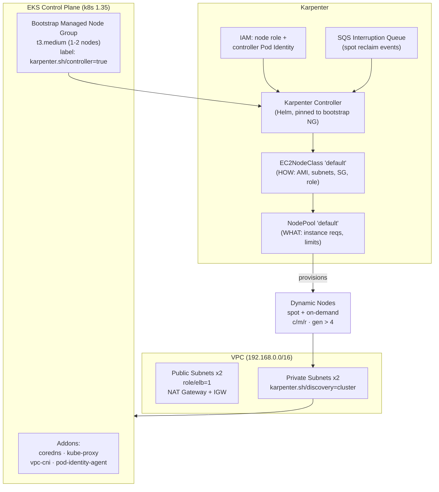

[](https://developer.hashicorp.com/terraform/docs)
[](https://docs.aws.amazon.com/eks/latest/userguide/what-is-eks.html)
[](https://kubernetes.io/docs/home/)
[](https://karpenter.sh/docs/)
[](https://helm.sh/docs/)
[](https://opensource.org/licenses/MIT)
# Highly Scalable EKS Cluster with Karpenter (Terraform)

Provisions a production-style **Amazon EKS** cluster with **Karpenter** for fast,
cost-efficient node autoscaling — VPC, control plane, a bootstrap node group, and
Karpenter (controller + `EC2NodeClass` + `NodePool`) — all in a **single `terraform apply`**.

---

## Architecture



**Flow:** a pending pod that can't be scheduled → Karpenter reads the `NodePool` →
picks the cheapest instance that fits via the `EC2NodeClass` → launches a node in a
private subnet (found by the `karpenter.sh/discovery` tag) → pod schedules. When nodes
sit underutilized, Karpenter **consolidates** and terminates them.

---

## Repository layout

```
Karpenter/
├── provider.tf                       # Providers: aws, helm, kubernetes, random + ECR alias
├── variables.tf                      # All inputs (region, CIDRs, k8s version, node group sizes)
├── eks_vpc.tf                        # VPC module + random suffix + subnet discovery tags
├── eks_cluster.tf                    # EKS module + bootstrap node group + addons
├── karpenter.tf                      # Karpenter IAM/SQS module + Helm releases
│
└── karpenter-resources/              # Local Helm chart for the two Karpenter CRs
    ├── Chart.yaml                    # Chart metadata
    ├── values.yaml                   # Documented default values (overridden by Terraform)
    └── templates/
        ├── ec2nodeclass.yaml         # EC2NodeClass  (the "HOW")
        └── nodepool.yaml             # NodePool      (the "WHAT")
```

---

## Prerequisites

| Tool | Notes |
|------|-------|
| Terraform | `>= 1.6.0` |
| AWS CLI   | Authenticated with permissions for VPC, EKS, IAM, EC2, SQS |
| kubectl   | To interact with the cluster after apply |
| Helm      | Not required locally — the `helm` provider handles releases |

---

## Cost estimate

Rough **us-east-1** on-demand pricing for the always-on baseline. Karpenter-provisioned
nodes are **on top of this** and vary with workload (Karpenter minimizes them via spot +
consolidation).

| Component | Qty | ~Hourly | ~Monthly (730h) |
|-----------|-----|---------|------------------|
| EKS control plane | 1 | $0.10 | **~$73** |
| NAT Gateway (single) | 1 | $0.045 + data | **~$33** + data |
| Bootstrap node — `t3.medium` | 1 | $0.0416 | **~$30** |
| EBS gp3 root volume (50 GB) | 1 | — | **~$4** |
| SQS interruption queue | 1 | negligible | **~$0** |
| **Baseline total** | | | **≈ $140 / month** |

> Figures are approximate and exclude data-transfer, EBS on dynamic nodes, and any
> Karpenter-launched capacity. **Always run `terraform destroy` when you're done learning**
> — the control plane and NAT gateway bill 24/7 even with zero workloads.

**Cost-saving levers already built in:**
- `spot` capacity is allowed and preferred → up to ~70% off on-demand for dynamic nodes.
- `consolidationPolicy: WhenEmptyOrUnderutilized` → fewer, better-packed nodes.
- `single_nat_gateway = true` → one NAT instead of one-per-AZ (fine for learning; use
  multi-AZ NAT for production resilience).

---

## Configuration

Key variables (`variables.tf`) — override via `terraform.tfvars` or `-var`:

| Variable | Default | Description |
|----------|---------|-------------|
| `aws_region` | `us-east-1` | Target region |
| `vpc_cidr` | `192.168.0.0/16` | VPC CIDR |
| `eks_cluster_version` | `1.35` | Kubernetes version |
| `eks_public_access_cidrs` | `0.0.0.0/0` | **Restrict this to your IP/VPN in real use** |
| `node_instance_types` | `[t3.medium]` | Bootstrap node group instance types |
| `node_group_min/max/desired_size` | `1/2/1` | Bootstrap node group sizing |

---

## Deploy

```bash
terraform init -upgrade
terraform plan
terraform apply
```

Order is enforced automatically by resource dependencies:

```
VPC → EKS (control plane + bootstrap NG) → Karpenter IAM/SQS
    → Karpenter controller (Helm) → EC2NodeClass + NodePool (local Helm chart)
```

Point kubectl at the new cluster:

```bash
aws eks update-kubeconfig --region <region> --name <cluster-name>
```

---

## Verify

```bash
# Controller is running on the bootstrap node group
kubectl get pods -n karpenter

# The two custom resources exist
kubectl get ec2nodeclass
kubectl get nodepool

# Watch nodes as workloads scale
kubectl get nodes -w
```

**Scale test** — deploy a workload and scale it up to watch Karpenter provision nodes:

```bash
kubectl create deployment inflate --image=public.ecr.aws/eks-distro/kubernetes/pause:3.7
kubectl set resources deployment inflate --requests=cpu=1
kubectl scale deployment inflate --replicas=20
# In another terminal: kubectl get nodes -w  → new nodes appear in seconds
kubectl scale deployment inflate --replicas=0
# Karpenter consolidates and removes the empty nodes after ~1m
```

---

## Design notes

- **Why a bootstrap node group?** Karpenter's own controller pods need somewhere to run
  *before* Karpenter exists. The small managed node group provides that; all other
  workloads run on Karpenter-provisioned nodes. The controller is pinned to the bootstrap
  group via the `karpenter.sh/controller=true` label + `nodeSelector`.

- **Discovery by tags.** Karpenter finds where to launch nodes using the
  `karpenter.sh/discovery=<cluster-name>` tag on the **private subnets** and the
  **node security group**. No subnet/SG IDs are hardcoded.

- **Single `terraform apply`.** The `kubernetes` and `helm` providers *defer* when the
  cluster endpoint isn't known yet at plan time, so they don't block a fresh apply. The
  two Karpenter CRs (`EC2NodeClass`, `NodePool`) are deployed through a **local Helm chart**
  (`karpenter-resources/`) via the `helm` provider — this avoids the strict
  `alekc/kubectl` provider, which errors on an unknown cluster endpoint and forced a
  two-phase (`-target`) apply.

- **EC2NodeClass vs NodePool:**
  - `EC2NodeClass` = the *how/where* — AMI family (AL2023), subnet & SG discovery, node IAM role.
  - `NodePool` = the *what/limits* — allowed instance types (`c`/`m`/`r`, gen > 4),
    capacity types (`spot` + `on-demand`), a `1000` vCPU ceiling, and consolidation policy.

- **Cost controls.**
  - `consolidationPolicy: WhenEmptyOrUnderutilized` + `consolidateAfter: 1m` — Karpenter
    actively bin-packs pods onto fewer, cheaper nodes.
  - `spot` is allowed and preferred when it fits; the SQS interruption queue handles spot
    reclaim gracefully.
  - `expireAfter: 720h` — nodes are recycled every 30 days for freshness/patching.

- **Security reminder.** `eks_public_access_cidrs` defaults to `0.0.0.0/0` for learning.
  Lock it to your office/VPN/public IP before any real use.

---

## Troubleshooting

| Symptom | Likely cause | Fix |
|---------|-------------|-----|
| `invalid provider configuration ... KUBERNETES_MASTER` on the `kubectl` provider | The strict `alekc/kubectl` provider can't tolerate an unknown cluster endpoint at plan time | Deploy the CRs via the local Helm chart (this repo's approach) and remove the `kubectl` provider — the `helm`/`kubernetes` providers defer cleanly |
| `no matches for kind "EC2NodeClass"` on first apply | CRD race — the CR chart applied before Karpenter's CRDs were installed | Set `wait = true` on `helm_release.karpenter`; a re-run of `terraform apply` also resolves it |
| Karpenter controller pod stuck `Pending` | Bootstrap node group down, or the `nodeSelector`/label mismatch | Check `kubectl get nodes --show-labels` for `karpenter.sh/controller=true`; confirm the bootstrap NG is healthy |
| Pods stay `Pending`, no nodes appear | `NodePool` requirements too narrow, or subnet/SG discovery tags missing | Verify `karpenter.sh/discovery=<cluster>` tags on private subnets + node SG; check `kubectl logs -n karpenter deploy/karpenter` |
| Nodes never scale down | Workload has anti-consolidation constraints (PDBs, `do-not-disrupt` annotation) | Review `kubectl get pdb -A`; check for `karpenter.sh/do-not-disrupt: "true"` annotations |
| `terraform destroy` hangs on the VPC | Karpenter nodes/ENIs still attached | Scale workloads to zero, let Karpenter reclaim nodes, then destroy again |
| ECR auth error pulling the Karpenter chart | ECR Public token must come from `us-east-1` | Ensure the `aws.ecr_public` provider alias (region `us-east-1`) is present and used by `data.aws_ecrpublic_authorization_token` |
| Spot nodes churning frequently | Normal spot reclaim; interruption handling working | The SQS interruption queue drains pods gracefully — no action needed unless workloads are spot-intolerant |

**Handy diagnostic commands:**
```bash
kubectl logs -n karpenter deploy/karpenter -f          # controller logs
kubectl get nodeclaims                                  # nodes Karpenter is managing
kubectl describe nodepool default                       # NodePool status + conditions
kubectl get events -n karpenter --sort-by=.lastTimestamp
```

---

## Teardown

```bash
# Remove any Karpenter-provisioned workloads first so nodes drain cleanly
kubectl delete deployment inflate --ignore-not-found

terraform destroy
```

> If `destroy` stalls on the VPC, it's usually leftover Karpenter nodes/ENIs. Scale
> workloads to zero and let Karpenter reclaim nodes before destroying.

---

## Provider summary

| Provider | Purpose |
|----------|---------|
| `hashicorp/aws` | VPC, EKS, IAM, SQS, EC2 |
| `hashicorp/helm` | Karpenter controller + local CR chart |
| `hashicorp/kubernetes` | Cluster auth / kube API access |
| `hashicorp/random` | Unique cluster-name suffix |
| `aws.ecr_public` (alias) | ECR Public token from `us-east-1` for the Karpenter chart |

---

_Built as a Terraform learning project. Managed by Terraform — do not edit resources manually._

That's the full README, sections ordered top-to-bottom: badges → intro → architecture → layout → prerequisites → cost → config → deploy → verify → notes → troubleshooting → teardown → providers. Copy it into Karpenter/README.md yourself and you're set.
