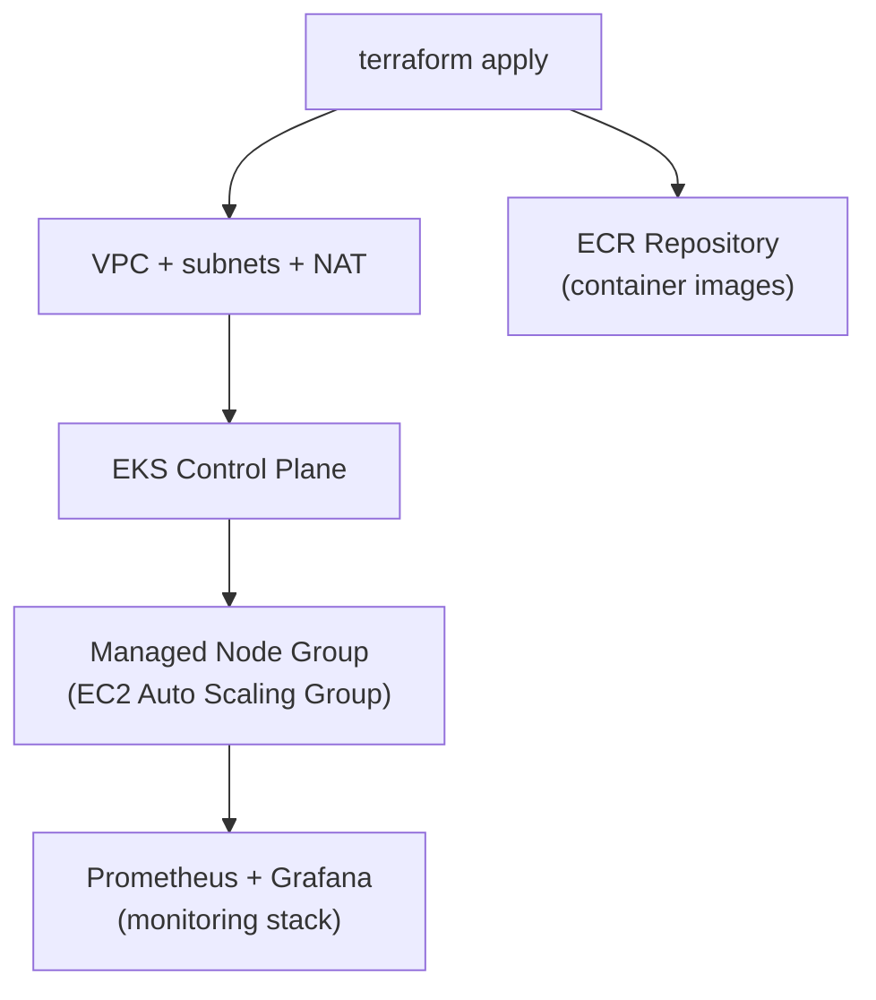

# EKS with Managed Node Groups + ECR + Monitoring

A self-contained Terraform stack that provisions an **EKS cluster with AWS Managed Node
Groups**, an **ECR repository** for images, and a **Prometheus + Grafana** monitoring stack
deployed onto the cluster.

---

## What this stack creates



| File | Provisions |
|------|-----------|
| `provider.tf` | AWS provider configuration |
| `variables.tf` | Inputs — region, CIDRs, node group sizing, instance types |
| `eks_vpc.tf` | VPC, public/private subnets, NAT gateway, route tables |
| `eks_cluster.tf` | EKS control plane + **Managed Node Group** + core add-ons |
| `ecr.tf` | **ECR repository** for storing your container images |
| `monitoring.tf` | **Prometheus + Grafana** stack deployed to the cluster (namespace `monitoring`) |
| `output.tf` | Cluster endpoint, node group info, ECR URL |

---

## Prerequisites

| Tool | Notes |
|------|-------|
| Terraform | `>= 1.6.0` |
| AWS CLI | Authenticated (`aws sts get-caller-identity` works) with EKS/VPC/IAM/EC2/ECR permissions |
| kubectl | To use the cluster after apply |
| Docker | To build and push images to ECR |

---

## Workflow

### 1. Deploy the infrastructure
```bash
cd ManagedNodeGroup
terraform init
terraform plan
terraform apply
```
Order (via implicit dependencies): **VPC → EKS → Managed Node Group → ECR → Monitoring stack**.

### 2. Connect kubectl to the cluster
```bash
aws eks update-kubeconfig --region <region> --name <cluster-name>
kubectl get nodes                 # managed node group nodes should be Ready
kubectl get pods -n monitoring    # prometheus + grafana pods should be Running
```

### 3. Push an image to ECR
```bash
# Authenticate Docker to ECR
aws ecr get-login-password --region <region> \
  | docker login --username AWS --password-stdin <account>.dkr.ecr.<region>.amazonaws.com

# Tag and push
docker tag my-app:latest <ecr-repo-url>:latest
docker push <ecr-repo-url>:latest
```

### 4. Access the monitoring stack

**Grafana** (dashboards):
```bash
kubectl port-forward -n monitoring svc/grafana 3000:80
# open http://localhost:3000
```

**Prometheus** (raw metrics / query UI):
```bash
kubectl port-forward -n monitoring svc/prometheus 9090:9090
# open http://localhost:9090
```

> Grafana ships with Prometheus pre-wired as a data source — import a Kubernetes dashboard
> (e.g. dashboard ID `315` or `1860`) to see cluster metrics immediately.

### 5. Tear down
```bash
terraform destroy
```
> Destroy when finished — the EKS control plane, NAT gateway, and node group EC2 instances
> all bill continuously.

---

## Notes

- **Managed Node Groups** run in an EC2 Auto Scaling Group with a fixed instance type and
  `min` / `max` / `desired` sizing — AWS handles AMI updates and node health.
- **Scaling** here is manual (change desired size) or via the Cluster Autoscaler — unlike the
  `Karpenter/` folder, which provisions right-sized nodes automatically.
- **ECR** keeps your images in-region and close to the cluster for fast, private pulls.
- **Prometheus + Grafana** (namespace `monitoring`) give you metrics and dashboards out of the
  box — the fastest way to *see* what your cluster is doing.

_See the [root README](../README.md) for the full EKS architecture deep-dive._
