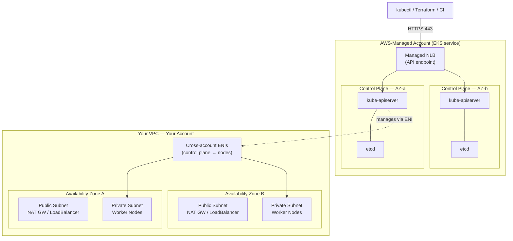
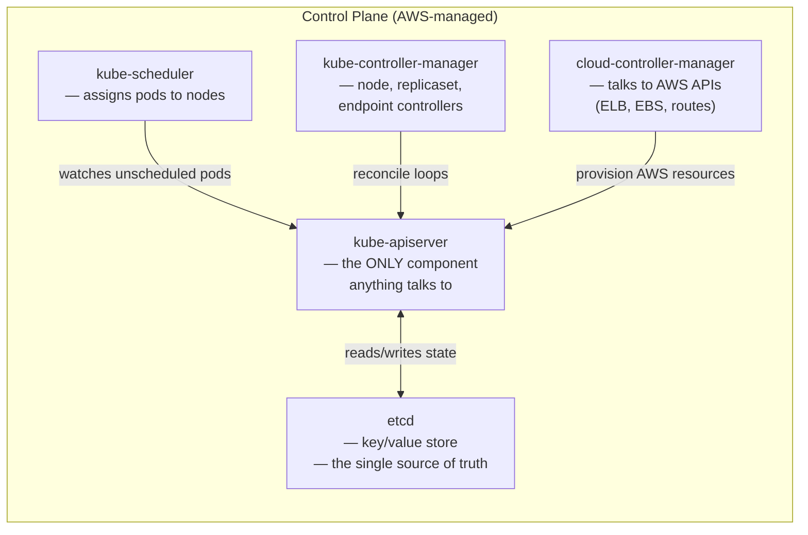
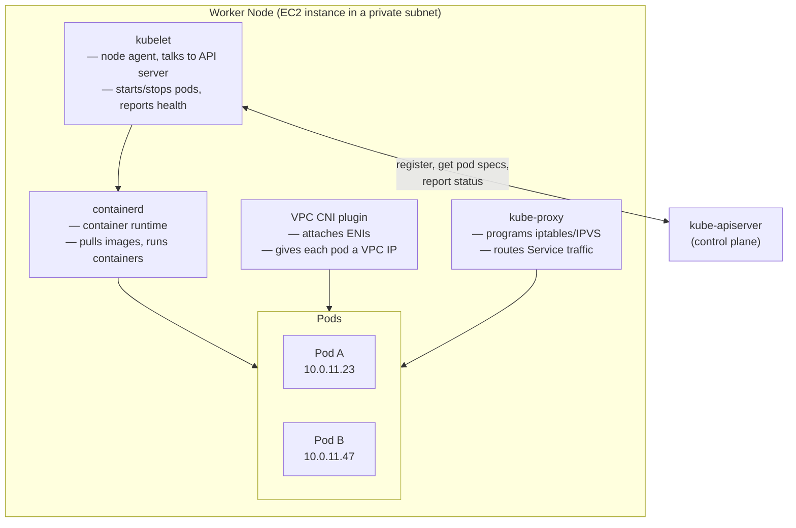
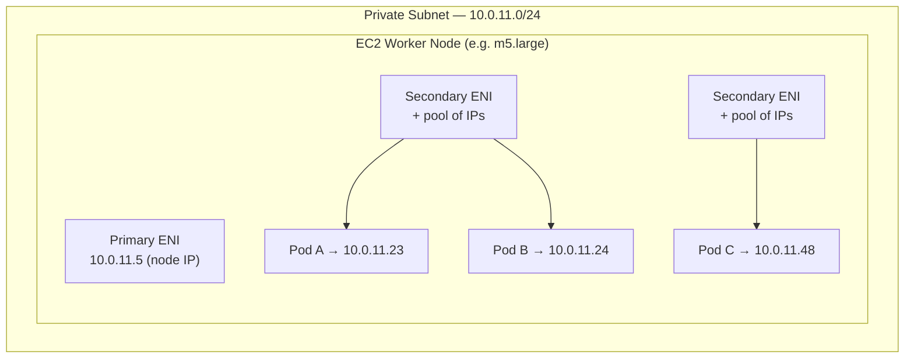
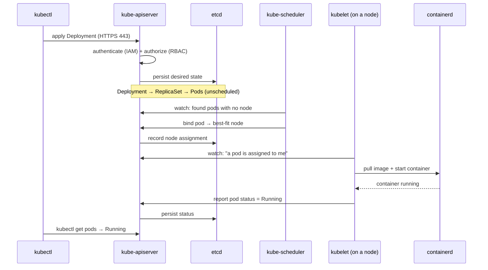
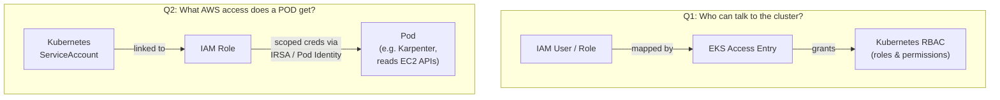
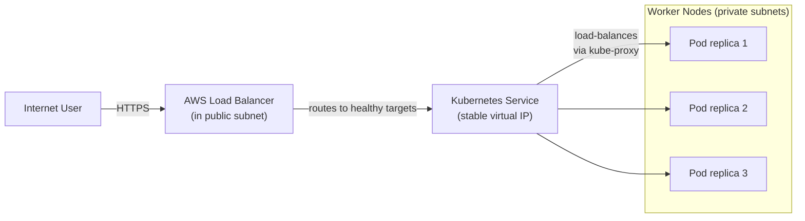
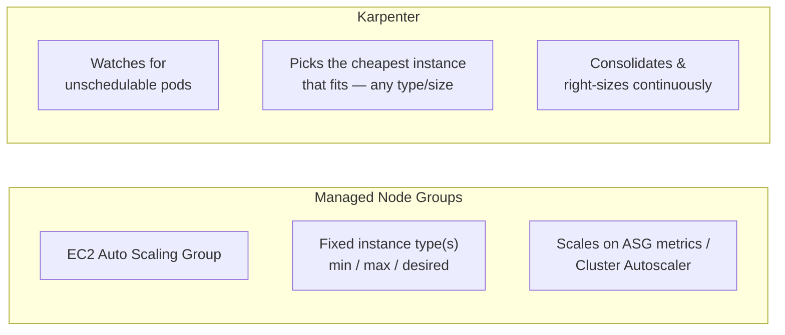

[](https://developer.hashicorp.com/terraform/docs)
[](https://docs.aws.amazon.com/eks/latest/userguide/what-is-eks.html)
[](https://kubernetes.io/docs/home/)
[](https://karpenter.sh/docs/)
[](https://helm.sh/docs/)
[](https://opensource.org/licenses/MIT)

# EKS Cluster with Terraform — Two Ways

Provision an **Amazon EKS** cluster with Terraform using **two different compute strategies**,
side by side, so you can learn the trade-offs:

| Approach | Folder | Best for |
|----------|--------|----------|
| **Managed Node Groups** | [`ManagedNodeGroup/`](./ManagedNodeGroup) | Predictable, steady workloads; simplest to reason about |
| **Karpenter** | [`Karpenter/`](./Karpenter) | Dynamic, spiky workloads; fast + cost-optimized autoscaling |

Both build the same foundation (VPC + EKS control plane) and differ only in **how worker
nodes are provisioned and scaled**.

---

## Table of Contents
- [EKS Architecture — Deep Dive](#eks-architecture--deep-dive)
- [The Two Compute Strategies](#the-two-compute-strategies)
- [Repository Structure](#repository-structure)
- [How to Provision](#how-to-provision)
- [Key Learning Takeaways](#key-learning-takeaways)
- [Further Reading](#further-reading)

---

## EKS Architecture — Deep Dive

Amazon EKS is **managed Kubernetes on AWS**. To really understand it, you need to see it
at several levels of zoom: the **whole cluster across AZs**, the **control plane internals**,
a **worker node's anatomy**, and the **networking + request flows** that tie it together.

### 1. The big picture — a cluster spans two accounts and multiple AZs

EKS physically splits into an **AWS-managed account** (control plane) and **your account**
(data plane), connected through cross-account network interfaces, spread across **multiple
Availability Zones** for high availability.



**Key ideas:**
- You **never see** the control plane EC2 instances or etcd — AWS runs, scales, patches,
  and backs them up across AZs.
- AWS injects **Elastic Network Interfaces (ENIs)** into *your* subnets so the control plane
  can talk to your kubelets securely — that's the bridge between the two accounts.
- Your **worker nodes live in private subnets**; public subnets hold only NAT gateways and
  internet-facing load balancers.

### 2. Control plane internals — the "brain"

Everything flows through the **API server**, and the true state of the world lives in
**etcd**. The other components are controllers that continuously drive *actual* state toward
*desired* state.



| Component | Responsibility |
|-----------|----------------|
| **kube-apiserver** | Front door for *all* operations; validates, authenticates, and persists to etcd. Everything else only talks to the API server. |
| **etcd** | Consistent, distributed key-value store holding the *entire* cluster state. |
| **kube-scheduler** | Watches for pods with no node assigned and picks the best node (resources, affinity, taints). |
| **kube-controller-manager** | Runs dozens of reconcile loops (node health, ReplicaSet counts, Service endpoints). |
| **cloud-controller-manager** | The AWS-aware controller — creates ELBs for `Service type=LoadBalancer`, attaches EBS volumes, manages routes. |

> **Mental model:** Kubernetes is a giant set of **reconciliation loops**. You declare
> *what you want*; controllers relentlessly work to make reality match — and keep it matched.

### 3. Worker node anatomy — the "muscle"

A worker node is just an **EC2 instance** running a few agents that connect it to the
control plane and run your containers.



| Agent | Job |
|-------|-----|
| **kubelet** | The node's agent. Registers the node, receives pod specs, and ensures containers run and stay healthy. |
| **containerd** | Pulls container images and runs them (the actual container runtime). |
| **kube-proxy** | Implements **Services** by programming iptables/IPVS so Service-IP traffic reaches a healthy pod. |
| **VPC CNI** | The AWS networking plugin — attaches secondary ENIs and hands out **real VPC IPs** to pods. |

### 4. Pod networking — why the VPC CNI matters

EKS networking is distinctive: **pods get IPs directly from your VPC subnets**, not from an
overlay. Pods are routable like any EC2 instance — but **pod density is capped by how many
IPs/ENIs an instance type supports**.



**Why this matters for scaling:**
- Each instance type supports a **fixed number of ENIs × IPs per ENI** → a hard ceiling on
  pods per node.
- **Karpenter** understands this and picks an instance size that fits your pods' resource
  *and* IP requirements — one reason it bin-packs so efficiently.
- Because pod IPs are real VPC IPs, **security groups, VPC flow logs, and routing** apply to
  pods directly.

### 5. Request flow — what happens on `kubectl apply`

Following one request end-to-end is the fastest way to internalize how the pieces cooperate.



**In words:** you declare intent → API server authenticates and stores it → scheduler
assigns pods → the target node's kubelet starts containers → status flows back to etcd. No
component ever bypasses the API server.

### 6. Identity & access — two separate questions

EKS answers **two different security questions** with **two different mechanisms**. Don't
confuse them.



| Question | Mechanism | Example |
|----------|-----------|---------|
| **Who can run `kubectl`?** | IAM principal → **EKS Access Entry** → Kubernetes RBAC | Your admin role gets `cluster-admin` |
| **What AWS APIs can a pod call?** | ServiceAccount → IAM Role via **IRSA** or **Pod Identity** | Karpenter's pod gets permission to launch EC2 |

> Access Entries are the modern, Terraform-friendly replacement for the old `aws-auth`
> ConfigMap. For pod-level AWS access, **Pod Identity** is the newer, simpler successor to
> IRSA (this repo's Karpenter setup uses Pod Identity).

### 7. External traffic — how a user reaches your app

An internet request travels through AWS load balancing, into a Kubernetes Service, and
finally to a pod.



- An **Ingress** or `Service type=LoadBalancer` triggers the cloud-controller / AWS Load
  Balancer Controller to provision an ALB/NLB in your **public** subnets.
- The **Service** provides a stable virtual IP; **kube-proxy** load-balances across
  currently-healthy replicas — even as pods come and go.
- Pods stay safely in **private** subnets; only the load balancer is internet-facing.

### Add-ons installed on every cluster in this repo
| Add-on | Job |
|--------|-----|
| `coredns` | In-cluster DNS (service discovery) |
| `kube-proxy` | Routes Service traffic to pods |
| `vpc-cni` | Assigns VPC IPs to pods |
| `eks-pod-identity-agent` | Delivers Pod Identity credentials to pods |

---

## The Two Compute Strategies

The control plane is **identical** in both folders — they differ only in how worker nodes
appear and scale.



| Dimension | Managed Node Groups | Karpenter |
|-----------|--------------------|-----------|
| **How nodes scale** | Adjust ASG desired count within min/max | Provisions exact nodes for pending pods |
| **Instance choice** | You pick fixed types up front | Karpenter picks optimal type/size per need |
| **Speed** | Minutes | Seconds |
| **Cost efficiency** | Good | Excellent (bin-packing + spot + consolidation) |
| **Spot handling** | Manual/limited | Built-in via SQS interruption queue |
| **Complexity** | Lowest | Moderate (CRDs + controller) |
| **Best for** | Baseline / steady capacity | Bursty, heterogeneous, cost-sensitive workloads |

> **Common real-world pattern:** a **small Managed Node Group** for system/baseline pods
> *and* **Karpenter** for everything dynamic — exactly what the `Karpenter/` folder does
> (the managed group bootstraps the Karpenter controller itself).

---

## Repository Structure

```
EKS_Cluster_Terraform/
│
├── ManagedNodeGroup/            # Approach 1 — AWS Managed Node Groups
│   ├── provider.tf              # AWS provider config
│   ├── variables.tf             # Inputs (region, CIDRs, node sizing)
│   ├── eks_vpc.tf               # VPC, subnets, NAT, tags
│   ├── eks_cluster.tf           # EKS control plane + managed node group + addons
│   ├── ecr.tf                   # Elastic Container Registry
│   ├── monitoring.tf            # CloudWatch logging / metrics
│   └── output.tf                # Cluster endpoint, node group, ECR outputs
│
└── Karpenter/                   # Approach 2 — Karpenter autoscaling
    ├── provider.tf              # aws, helm, kubernetes, random providers
    ├── variables.tf             # Inputs
    ├── eks_vpc.tf               # VPC + karpenter.sh/discovery tags
    ├── eks_cluster.tf           # EKS + bootstrap node group (runs Karpenter)
    ├── karpenter.tf             # Karpenter IAM/SQS module + Helm releases
    ├── karpenter-resources/     # Local Helm chart: EC2NodeClass + NodePool
    └── README.md                # Deep-dive for the Karpenter approach
```

---

## How to Provision

### Prerequisites
| Tool | Notes |
|------|-------|
| Terraform | `>= 1.6.0` |
| AWS CLI | Authenticated (`aws sts get-caller-identity` works) with EKS/VPC/IAM/EC2 permissions |
| kubectl | To use the cluster after apply |

### Deploy either approach
Pick a folder and run Terraform inside it:

```bash
# Approach 1 — Managed Node Groups
cd ManagedNodeGroup
terraform init
terraform plan
terraform apply

# --- or ---

# Approach 2 — Karpenter (single apply; see Karpenter/README.md for details)
cd Karpenter
terraform init -upgrade
terraform plan
terraform apply
```

### Connect to the cluster
```bash
aws eks update-kubeconfig --region <region> --name <cluster-name>
kubectl get nodes
kubectl get pods -A
```

### Tear down (avoid ongoing charges!)
```bash
terraform destroy
```
> The EKS control plane and NAT gateway bill 24/7 — always destroy learning clusters when done.

---

## Key Learning Takeaways

1. **Control plane vs data plane** — AWS manages the brain; you manage the muscle. Every EKS
   decision maps to one of these two planes.
2. **Everything flows through the API server** — controllers, kubelets, and `kubectl` all
   talk only to the API server; etcd is the single source of truth.
3. **Kubernetes is reconciliation loops** — you declare desired state, and controllers keep
   reality matching it. There is no imperative "do it now."
4. **Pods get VPC IPs** — the VPC CNI means pod density is limited by ENI/IP capacity per
   instance type, which directly shapes how you (or Karpenter) size nodes.
5. **Scaling is a compute-strategy choice, not an EKS feature** — the control plane is
   identical; MNG and Karpenter are just two answers to "where do pods run?"
6. **Tags are the glue** — subnet/SG discovery tags let load balancers and Karpenter find
   the right infrastructure without hardcoded IDs.
7. **Two security questions, two mechanisms** — Access Entries control *who can use the
   cluster*; IRSA / Pod Identity control *what AWS access a pod gets*.

---

## Further Reading
- [Amazon EKS User Guide](https://docs.aws.amazon.com/eks/latest/userguide/what-is-eks.html)
- [Karpenter Docs](https://karpenter.sh/docs/)
- [terraform-aws-modules/eks](https://github.com/terraform-aws-modules/terraform-aws-eks)
- [EKS Best Practices Guide](https://aws.github.io/aws-eks-best-practices/)
- [Kubernetes Components](https://kubernetes.io/docs/concepts/overview/components/)

---

_A Terraform learning project comparing Managed Node Groups and Karpenter on Amazon EKS._
